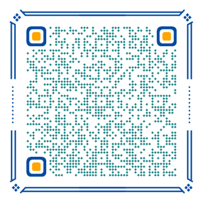

## 🌄 网站介绍

**地信遥感资源教程网**

目标：解决目前地信遥感方向数据混杂，资源难以寻找的问题，构建一个地信遥感学习、讨论、交流的平台。

:::tip
网站内容正在逐步共建和上线，欢迎加入共建群。
:::

[开发日志](https://docs.qq.com/doc/DTUlDbWp4dlJyZHZE)

[更新日志](https://github.com/Gleaner2021/website_3s_hub/commits)

## 🌌 参与共建

遥感地信资源网站共建~

遥感地信经验技巧交流~

:::

发现bug

如果你发现了数据下载方法错误或者过时:

1.进入该网站的**[GitHub](https://github.com/ruiduobao/ruiduobao.com.git)仓库**，提交修改后的md文档或网站大纲；

2.或者进入问题反馈QQ群。

:::

写在最后

1.本网站的页面内容，已经在[GitHub](https://github.com/ruiduobao/ruiduobao.com.git)上开源。欢迎各相关行业同学，增删改查。

2.参与本站的文档编写工作，请在文档中留下作者相关资料（比如个人昵称、头像、个人介绍、打赏二维码、个人公众号等等）

3.如果需要使用本站内容，请标明出处和相关作者。
